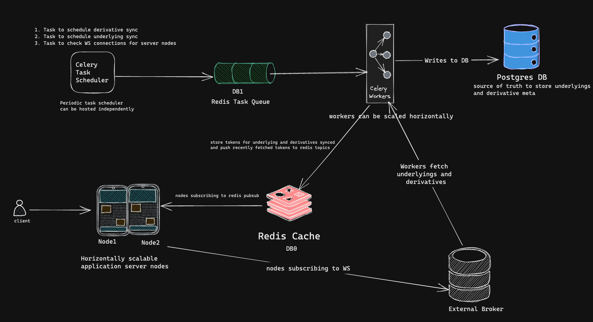

# Sensi App
Pulls real-time underlyings and derivatives prices and shows them to the client through apis.

## Running the application
The complete application is dockerized and docker-compose can be used to run the application.
To handle environment variables config/.env file needs to be created. config/env.sample provided for reference.
You can directly run following command without actually changing .env file to start the application.
```bash
cd docker && docker-compose up
```

## Design Components
### Application Server
FastApi application hosts the APIs for underlying and derivatives latest prices.
These APIs fetch entities from DB and populate prices by looking at Redis Hash _ENTITY_PRICE_DATA_.

### Application Server Pub/Sub and WebSocket connection
1. Every node creates a node_id and registers itself by pushing node_id in Hash _NODE_IDS_IN_CLUSTER_.
2. Every node would start a background thread to subscribe to Redis pubsub topics _WS_RECONNECT_ and _WS_ENTITY_PUSH_.
3. Every node would start an async process to listen to WebSocket server messages.

### Celery Scheduler and Worker
Celery scheduler is used to periodically trigger the tasks. We have 3 tasks in the current application. A single instance of Scheduler is sufficient for application and workers can be horizontally scaled.
1. Task to sync underlyings.
2. Task to sync derivatives.
3. Task to check whether web socket connections are active on all instances.

### Redis and Task queue
Redis is used as a key-value storage db as well as an async task queue for celery. db0 is used for key-value and db1 for task queue.

### Postgres DB
Postgres DB is source of truth for metadata of derivatives and underlyings. Derivatives table has a foreign key reference to the underlying it belongs to. Script to initiate db tables is provided in scripts folder.

## Usecases
### Handling syncs from broker.
1. We call broker underlyings API periodically, every 5 mins, and sync underlyings in DB. We also store underlying tokens and ids in Redis Set(keyname = _UNDERLYINGS_DATA_) for further use cases. For every sync, we check that incoming underlying should not be present in already synced underlyings by looking at this Set. 
2. Same logic as underlyings sync used for dervatives sync with the frequency of 1 min. Also, we maintain cached data in Set with key name = _DERIVATIVES_DATA:{underlying_token}_ to identify derivatives that need to be synced.
3. We have handles cache miss scenarios for both the above keys.

### Fetching prices for underlyings and derivatives.
1. In both of the above sync we publish a message on redis pubsub topic = _WS_ENTITY_PUSH_ and message = _ENTITY_REFRESH_. Also, we push the synced tokens in redis Set with key name _ENTITY_TOKENS_TO_BE_SYNCED_ for the application server to consume.
2. If server nodes receive message on topic _WS_ENTITY_PUSH_ that means new entities are fetched and node needs to subscribe to these entity tokens from broker WS. Node would get the entity tokens to subscribe from Set _ENTITY_TOKENS_TO_SYNC_ set and delete the Set key. This would make sure that only one node would subscribe to the given entity tokens from broker even though topic message goes to all the nodes. Node would put the subscribed entity tokens into Set _NODE_ID_WS_ENTITY_MAPPING:{Node_id}_. When this node goes down orchestrator would know which entities to subscribe to again when node comes up by looking at this Set values.

### Populating prices for underlyings and derivatives.
1. Once node server subscribes to the token from broker WS , it would start receiving prices from token.
2. When node receives these prices it populates token and price data in Redis Hash _ENTITY_PRICE_DATA_.
2. When API to fetch underlyings or derivatives are called , node looks at this Hash to fetch prices from Redis and populate prices data on the fly.

### Handling WS disconnects
1. On every message from websocket we update the timestamp of last ping for that node websocket connection in Redis Hash _LAST_PING_TIME_FROM_WS_ .
2. We have a task in celery that checks Node and their last ping timestamps from this Hash with frequency of 1 min.This task checks whether last ping timestamp for node is not older than allowed time (60 sec). If any of the timestamp is older then worker would publish a message of node_id on topic _WS_RECONNECT_ so that node application can reconnect the WebSocket.
1. If nodes receive a message on topic _WS_RECONNECT_ and the message node_id matches its own node id that means node needs to reconnect the WebSocket. Even though all nodes would receive these messages on topic only node whose node_id is matching message node_id would reconnect to the websocket.

## Future Scope
1. We can have a coordinator node or orchestractor node which handles the distribution of websocket subscriptions across multiple ndes. Currently any node can randomly receive tokens to subscribe and is not evenly distributed.
2. This coordinator node can also keep doing health checks on all the register nodes looking at _NODE_IDS_IN_CLUSTER_ and if any node goes down it can redistribute the WS connections handled by that node by looking at redis set _NODE_ID_WS_ENTITY_MAPPING:{Node_id}_ .

## API Documentation
[API Documentation](https://documenter.getpostman.com/view/15455073/2s935uGLgU)


## Design Diagram
